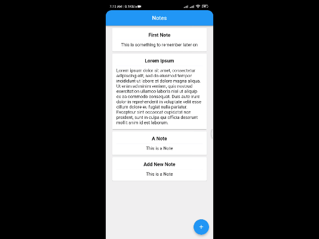
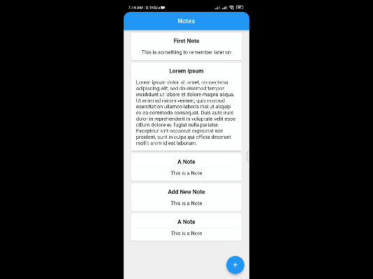
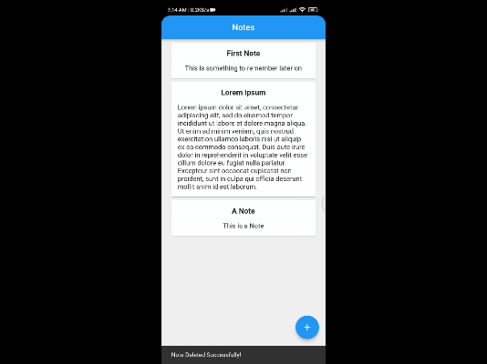

# note_keeping_app

A new Flutter project. Uses sqflite package to store Data in Local Database of Android or IOS.

## Getting Started

# Add Note
[]

# Delete Note
[]

# Edit Note
[]

### Setup

Get the code

<pre>git clone https://github.com/hamzaawan007/note_keeping_app.git</pre>
 
Install required dependencies

<pre>flutter pub get</pre>

Start the app

<pre>flutter run</pre>

